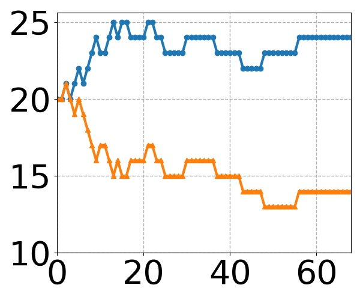

# FedTuning
Source code for our paper [FedTuning](https://arxiv.org/abs/2110.03061). Please consider citing our paper if our paper and codes are helpful to you.

```
@article{fedtuning,
    author = {Huanle Zhang and Mi Zhang and Xin Liu and Prasant Mohapatra and Michael DeLucia},
    title = {Automatic Tuning of Federated Learning Hyper-Parameters from System Perspective},
    journal = {arXiv:2110.03061},
    year = {2021}
}
```

**Note**: we re-design our algorithm, which shows better results. We will update our arXiv paper ASAP.

Codes are tested on (1) Ubuntu 18.04 with a 32GB Tesla V100 GPU, cuda:11.4, and (2) Ubuntu 20.04 with 24GB Nvidia RTX A5000 GPUs, cuda:11.3.
Both use PyTorch 1.9.1 and Python 3.9.

Require following packages
```plain
pytorch, matplotlib, scikit-image, librosa, pandas
```


## Dataset Download and Preprocess

### Google speech-to-command dataset

1. download dataset, which is saved to Download/speech_command/.  
    ```python:
    python Dataset/speech_command/speech_command_download.py
    ```

2. preprocess.
    (1) separate clients' data for training, validation, and testing;
    (2) transform audio clips to spectrograms;
    (3) save spectrograms to jpg images.
    Preprocessed data are saved to Download/speech_command/_FedTuning/
      ```python:
      python Dataset/speech_command/speech_command_preprocess.py
      ```

Model hyper-parameters such as learning rate and batch size are defined Dataset/speech_command/\_\_init\_\_.py

### Other datasets

TODO

## Experiments

The algorithm of FedTuning is in FedTuning/FedTuningTuner.py

1. FL training with FedTuning enabled
    ```python:
    python FedTuning/main.py --enable_fedtuning True --alpha 0.25 --beta 0.25 --gamma 0.25 --delta 0.25 --model resnet_10 --target_model_accuracy 0.8 --n_participant 20 --n_training_pass 20 --dataset speech_command
    ```
   Required arguments:
   * --enable_fedtuning True
   * --alpha: preference on computation time (CompT)
   * --beta: preference on transmission time (TransT)
   * --gamma: preference on computation load (CompL)
   * --delta: preference on transmission load (TransL)
   * --model: model name. Supported models are under Model/. More models will be supported.
   * --target_model_accuracy. Stop training when trained model has accuracy higher than the target accuracy
   * --dataset: dataset name. Now only support speech_command, more dataset will be supported
   * --n_participant: number of participants (M)
   * --n_training_pass: number of training passes (E)

2. FL training without FedTuning
    ```python:
    python FedTuning/main.py --enable_fedtuning False --model resnet_10 --target_model_accuracy 0.8 --n_participant 20 --n_training_pass 20 --dataset speech_command
    ```
   Required arguments:
   * --enable_fedtuning False
   * --model
   * --target_model_accuracy
   * --dataset
   * --n_participant
   * --n_training_pass

3. Optional arguments
   * --n_consecutive_better: number of trained model is consecutively better than the target accuracy before stop training. Default 5.
   * --trace_id: trace id. Default 1.
   * --penalty: penalty factor when bad decision occurs. Still testing the usefulness of it. Default 1.

Results are saved to Result/. See the running output for the full filename. Results are saved in CSV files, in the format of
```plain
#round_id,model_accuracy,eta_t,eta_q,eta_z,eta_v,zeta_t,zeta_q,zeta_z,zeta_v,number of participant (M),number of training pass (E),cost of each selected client
```

## Formulation

On each training round, the cost of each selected client is returned via the following statement (in FeTuning/main.py)
```python:
cost_arr = FL_server.get_cost_of_selected_clients(client_ids=selected_client_ids)
```
We calculate computation time, transmission time, computation load, and transmission load of a training round by
```python:
# computation time (compT), transmission time (transT), computation load (compL), and transmission load (transL) on each training round
round_compT = C_1 * max(cost_arr)
round_transT = C_2 * 1.0
round_compL = C_3 * sum(cost_arr)
round_transL = C_4 * len(cost_arr)
```

FedTuning does not depend on the absolute values of C_1, C_2, C_3, and C_4, as it is based on their respective ratios. Therefore, we assign C_1, C_2, C_3, and C_4 to 1.

## Result Processing

Result processing scripts are under ResultAnalysis/

* overall_performance.py: calculate and compare CompT, TransT, CompL, and TransL for different traces.

## Result Visualization

Result visualization scripts are under ResultAnalysis/.

### Trajectory visualization

decision_trajectory.py: visualize a trace's trajectories of M and E. Below are few examples when alpha = beta = gamma = delta = 0.25 (a tough case of equal preference) and we change the penalty factor.  

Improvement | Penalty | Trajectory
:---: | :---:    | :---:
+10.99% | 1 | 
+14.21% | 2 | 
+13.58% | 3 | 
+16.95% | 4 | 
+0.47% | 5 | 
+11.29% | 6 | 
+4.13% | 7 | 
+12.73% | 8 | 
+11.44% | 9 | 
+16.66% | 10 | 

### Study of Penalty Factor

penalty_performance.py: plot improvement ratio vs penalty 


## Result Summary

Google speech-to-command dataset. ResNet-10. Target model accuracy: 0.8


| alpha | beta | gamma | delta | penalty | trace id | CompT (10^12) | TransT (10^6) | CompL (10^12) | TransL (10^6) | Final M | Final E | Overall |
| :---: | :---: | :---: | :---: | :---: | :---: | :---: | :---: | :---: | :---: | :---: | :---: | :---: |
| - | - | - | - | - | [1] | 2.31 (0.00) | 5.90 (0.00) | 14.41 (0.00) | 117.98 (0.00) | 20.00 (0.00) | 20.00 (0.00) | - |
| 1.0 | 0.0 | 0.0 | 0.0 | 1 | [1] | 0.64 (0.00) | 7.41 (0.00) | 5.60 (0.00) | 272.47 (0.00) | 42.00 (0.00) | 1.00 (0.00) | +72.21% |
| 0.0 | 1.0 | 0.0 | 0.0 | 1 | [1] | 3.30 (0.00) | 4.15 (0.00) | 32.49 (0.00) | 142.77 (0.00) | 41.00 (0.00) | 41.00 (0.00) | +29.73% |
| 0.0 | 0.0 | 1.0 | 0.0 | 1 | [1] | 0.96 (0.00) | 17.22 (0.00) | 3.18 (0.00) | 68.79 (0.00) | 1.00 (0.00) | 1.00 (0.00) | +77.94% |
| 0.0 | 0.0 | 0.0 | 1.0 | 1 | [1] | 12.79 (0.00) | 44.00 (0.00) | 19.62 (0.00) | 91.19 (0.00) | 1.00 (0.00) | 40.00 (0.00) | +22.70% |
| 0.5 | 0.5 | 0.0 | 0.0 | 1 | [1] | 2.20 (0.00) | 3.99 (0.00) | 22.06 (0.00) | 137.43 (0.00) | 41.00 (0.00) | 23.00 (0.00) | +18.67% |
| 0.5 | 0.0 | 0.5 | 0.0 | 1 | [1] | 0.62 (0.00) | 7.17 (0.00) | 4.36 (0.00) | 187.09 (0.00) | 27.00 (0.00) | 1.00 (0.00) | +71.39% |
| 0.5 | 0.0 | 0.0 | 0.5 | 1 | [1] | 2.61 (0.00) | 5.02 (0.00) | 17.13 (0.00) | 104.11 (0.00) | 24.00 (0.00) | 22.00 (0.00) | -0.55% |
| 0.0 | 0.5 | 0.5 | 0.0 | 1 | [1] | 1.40 (0.00) | 6.38 (0.00) | 7.12 (0.00) | 77.40 (0.00) | 7.00 (0.00) | 7.00 (0.00) | +21.24% |
| 0.0 | 0.5 | 0.0 | 0.5 | 1 | [1] | 6.58 (0.00) | 11.32 (0.00) | 20.78 (0.00) | 96.30 (0.00) | 4.00 (0.00) | 42.00 (0.00) | -36.76% |
| 0.0 | 0.0 | 0.5 | 0.5 | 1 | [1] | 9.01 (0.00) | 33.96 (0.00) | 13.05 (0.00) | 67.44 (0.00) | 1.00 (0.00) | 36.00 (0.00) | +26.16% |
| 0.33 | 0.33 | 0.33 | 0.0 | 1 | [1] | 0.85 (0.00) | 4.94 (0.00) | 7.89 (0.00) | 173.14 (0.00) | 42.00 (0.00) | 6.00 (0.00) | +41.21% |
| 0.33 | 0.33 | 0.0 | 0.33 | 1 | [1] | 2.36 (0.00) | 4.30 (0.00) | 21.26 (0.00) | 129.38 (0.00) | 35.00 (0.00) | 23.00 (0.00) | +5.03% |
| 0.33 | 0.0 | 0.33 | 0.33 | 1 | [1] | 6.78 (0.00) | 18.57 (0.00) | 15.60 (0.00) | 86.81 (0.00) | 2.00 (0.00) | 34.00 (0.00) | -57.73% |
| 0.0 | 0.33 | 0.33 | 0.33 | 1 | [1] | 3.50 (0.00) | 7.09 (0.00) | 13.44 (0.00) | 79.32 (0.00) | 8.00 (0.00) | 34.00 (0.00) | +6.36% |
| 0.25 | 0.25 | 0.25 | 0.25 | 1 | [1] | 1.83 (0.00) | 4.46 (0.00) | 14.09 (0.00) | 122.36 (0.00) | 33.00 (0.00) | 13.00 (0.00) | +10.99% |
