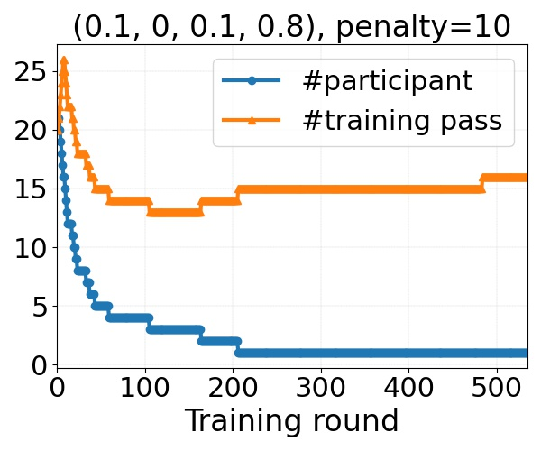

# FedTuning
Source code for our paper [FedTuning](https://arxiv.org/abs/2110.03061). Please consider citing our paper if our paper and codes are helpful to you.

```
@article{fedtuning,
    author = {Huanle Zhang and Mi Zhang and Xin Liu and Prasant Mohapatra and Michael DeLucia},
    title = {Automatic Tuning of Federated Learning Hyper-Parameters from System Perspective},
    journal = {arXiv:2110.03061},
    year = {2021}
}
```

**Note**: we re-design our algorithm, which shows better results. We will update our arXiv paper ASAP.

Codes are tested on (1) Ubuntu 18.04 with a 32GB Tesla V100 GPU, cuda:11.4, and (2) Ubuntu 20.04 with 24GB Nvidia RTX A5000 GPUs, cuda:11.3.
Both use PyTorch 1.9.1 and Python 3.9.

Require following packages
```plain
pytorch, matplotlib, scikit-image, librosa, pandas
```


## Dataset Download and Preprocess

### Google speech-to-command dataset

1. download dataset, which is saved to Download/speech_command/.  
    ```python:
    python Dataset/speech_command/speech_command_download.py
    ```

2. preprocess. 
    (1) separate clients' data for training, validation, and testing; 
    (2) transform audio clips to spectrograms; 
    (3) save spectrograms to jpg images. 
    Preprocessed data are saved to Download/speech_command/_FedTuning/
      ```python:
      python Dataset/speech_command/speech_command_preprocess.py
      ```

Model hyper-parameters such as learning rate and batch size are defined Dataset/speech_command/\_\_init\_\_.py

### Other datasets

TODO 

## Experiments

The algorithm of FedTuning is in FedTuning/FedTuningTuner.py

1. FL training with FedTuning enabled
    ```python:
    python FedTuning/main.py --enable_fedtuning True --alpha 0.25 --beta 0.25 --gamma 0.25 --delta 0.25 --model resnet_10 --target_model_accuracy 0.8 --n_participant 10 --n_training_pass 10 --dataset speech_command
    ```
   Required arguments: 
   * --enable_fedtuning True
   * --alpha: preference on computation time (CompT)
   * --beta: preference on transmission time (TransT)
   * --gamma: preference on computation load (CompL)
   * --delta: preference on transmission load (TransL)
   * --model: model name. Supported models are under Model/. More models will be supported.
   * --target_model_accuracy. Stop training when trained model has accuracy higher than the target accuracy
   * --dataset: dataset name. Now only support speech_command, more dataset will be supported
   * --n_participant: number of participants (M)
   * --n_training_pass: number of training passes (E) 
   
2. FL training without FedTuning
    ```python:
    python FedTuning/main.py --enable_fedtuning False --model resnet_10 --target_model_accuracy 0.8 --n_participant 10 --n_training_pass 10 --dataset speech_command
    ```
   Required arguments:
   * --enable_fedtuning False
   * --model
   * --target_model_accuracy
   * --dataset 
   * --n_participant
   * --n_training_pass

3. Optional arguments
   * --n_consecutive_better: number of trained model is consecutively better than the target accuracy before stop training. Default 5.
   * --trace_id: trace id. Default 1.
   * --penalty: penalty factor when bad decision occurs. Still testing the usefulness of it. Default 1. 

Results are saved to Result/. See the running output for the full filename. Results are saved in CSV files, in the format of
```plain
#round_id,model_accuracy,eta_t,eta_q,eta_z,eta_v,zeta_t,zeta_q,zeta_z,zeta_v,number of participant (M),number of training pass (E),cost of each selected client
```

## Formulation

On each training round, the cost of each selected client is returned via the following statement (in FeTuning/main.py)
```python:
cost_arr = FL_server.get_cost_of_selected_clients(client_ids=selected_client_ids)
```
We calculate computation time, transmission time, computation load, and transmission load of a training round by
```python:
# computation time (compT), transmission time (transT), computation load (compL), and transmission load (transL) on each training round
round_compT = C_1 * max(cost_arr)
round_transT = C_2 * 1.0
round_compL = C_3 * sum(cost_arr)
round_transL = C_4 * len(cost_arr)
```

FedTuning does not depend on the absolute values of C_1, C_2, C_3, and C_4, as it is based on their respective ratios. Therefore, we assign C_1, C_2, C_3, and C_4 to 1. 

## Result Processing

Result processing scripts are under ResultAnalysis/

* overall_performance.py: calculate and compare CompT, TransT, CompL, and TransL for different traces. 

## Result Visualization

Result visualization scripts are under ResultAnalysis/.

* decision_trajectory.py: visualize trajectories of M and E. Below are few examples when alpha = beta = gamma = delta = 0.25 (a tough case of no preference) and the penalty factor is adjusted. 
   
Improvement | Penalty | Trajectory
:---: | :---:    | :---: 
+4.91% | 1 | 
+11.60% | 10 | 

## Result Summary


Google speech-to-command dataset. ResNet-10. Target model accuracy: 0.8

| alpha | beta | gamma | delta | penalty | trace id | CompT (10^12) | TransT (10^6) | CompL (10^12) | TransL (10^6) | Final M | Final E | Overall |
| :---: | :---: | :---: | :---: | :---: | :---: | :---: | :---: | :---: | :---: | :---: | :---: | :---: |
| - | - | - | - | - | 1 | 2.31 |  5.90 | 14.41 | 117.98 | 20 | 20.0 | - |
| 1 | 0 | 0 | 0 | 1 | 1 | 0.64 |  7.41 | 5.60 | 272.47 | 42 | 1.0 | +72.21% |
| 0 | 0 | 1 | 0 | 1 | 1 | 0.96 |  17.22 | 3.18 | 68.79 | 1 | 1.0 | +77.94% |
| 0 | 0 | 1 | 0 | 5 | 1 | 0.82 |  47.83 | 2.37 | 76.85 | 1 | 1.0 | +83.56% |
| 0.25 | 0.25 | 0.25 | 0.25 | 1 | 1 | 1.83 |  4.46 | 14.09 | 122.36 | 33 | 13.0 | +4.91% |
| 0.25 | 0.25 | 0.25 | 0.25 | 10 | 1 | 1.95 |  4.70 | 12.51 | 97.17 | 23 | 23.0 | +11.6% |
| 0.1 | 0 | 0.1 | 0.8 | 1 | 1 | 3.44 |  7.01 | 12.53 | 69.75 | 9 | 29.0 | +29.12% |
| 0.1 | 0 | 0.1 | 0.8 | 10 | 1 | 5.67 |  42.73 | 11.07 | 105.86 | 1 | 16.0 | -3.96% |
| 0.1 | 0 | 0.1 | 0.8 | 10 | 2 | 2.89 |  5.02 | 16.23 | 91.99 | 13 | 35.0 | +13.86% |
| 0.5 | 0 | 0 | 0.5 | 1 | 1 | 2.05 |  4.62 | 12.79 | 89.20 | 21 | 27.0 | +17.91% |
| 0.5 | 0 | 0 | 0.5 | 10 | 2 | 2.24 |  4.86 | 15.01 | 104.35 | 24 | 20.0 | +7.26% |


