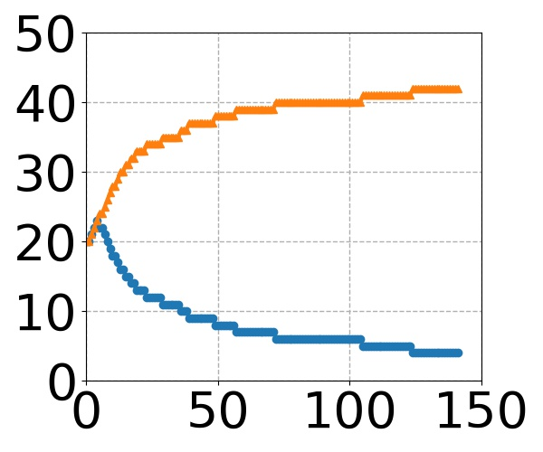
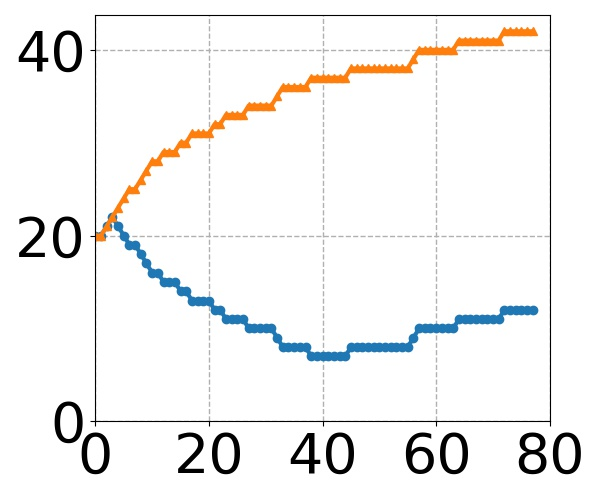

# FedTuning
Source code for our paper [FedTuning](https://arxiv.org/abs/2110.03061). Please consider citing our paper if our paper and codes are helpful to you.

```
@article{fedtuning,
    author = {Huanle Zhang and Mi Zhang and Xin Liu and Prasant Mohapatra and Michael DeLucia},
    title = {Automatic Tuning of Federated Learning Hyper-Parameters from System Perspective},
    journal = {arXiv:2110.03061},
    year = {2021}
}
```


Codes are tested on (1) Ubuntu 18.04 with a 32GB Tesla V100 GPU, cuda:11.4, and (2) Ubuntu 20.04 with 24GB Nvidia RTX A5000 GPUs, cuda:11.3.
Both use PyTorch 1.9.1 and Python 3.9.

Require following packages
```plain
pytorch, matplotlib, scikit-image, librosa, pandas
```


## Dataset Download and Preprocess

### Google speech-to-command dataset

1. download dataset, which is saved to Download/speech_command/.  
    ```python:
    python Dataset/speech_command/speech_command_download.py
    ```

2. preprocess.
    (1) separate clients' data for training, validation, and testing;
    (2) transform audio clips to spectrograms;
    (3) save spectrograms to jpg images.
    Preprocessed data are saved to Download/speech_command/_FedTuning/
      ```python:
      python Dataset/speech_command/speech_command_preprocess.py
      ```

Model hyper-parameters such as learning rate and batch size are defined Dataset/speech_command/\_\_init\_\_.py

### Other datasets

TODO

## Experiments

The algorithm of FedTuning is in FedTuning/FedTuningTuner.py

1. FL training with FedTuning enabled
    ```python:
    python FedTuning/main.py --enable_fedtuning True --alpha 0.25 --beta 0.25 --gamma 0.25 --delta 0.25 --model resnet_10 --target_model_accuracy 0.8 --n_participant 20 --n_training_pass 20 --dataset speech_command
    ```
   Required arguments:
   * --enable_fedtuning True
   * --alpha: preference on computation time (CompT)
   * --beta: preference on transmission time (TransT)
   * --gamma: preference on computation load (CompL)
   * --delta: preference on transmission load (TransL)
   * --model: model name. Supported models are under Model/. More models will be supported.
   * --target_model_accuracy. Stop training when trained model has accuracy higher than the target accuracy
   * --dataset: dataset name. Now only support speech_command, more dataset will be supported
   * --n_participant: number of participants (M)
   * --n_training_pass: number of training passes (E)

2. FL training without FedTuning
    ```python:
    python FedTuning/main.py --enable_fedtuning False --model resnet_10 --target_model_accuracy 0.8 --n_participant 20 --n_training_pass 20 --dataset speech_command
    ```
   Required arguments:
   * --enable_fedtuning False
   * --model
   * --target_model_accuracy
   * --dataset
   * --n_participant
   * --n_training_pass

3. Optional arguments
   * --n_consecutive_better: number of trained model is consecutively better than the target accuracy before stop training. Default 5.
   * --trace_id: trace id. Default 1.
   * --penalty: penalty factor when bad decision occurs. Still testing the usefulness of it. Default 1.

Results are saved to Result/. See the running output for the full filename. Results are saved in CSV files, in the format of
```plain
#round_id,model_accuracy,eta_t,eta_q,eta_z,eta_v,zeta_t,zeta_q,zeta_z,zeta_v,number of participant (M),number of training pass (E),cost of each selected client
```

## Formulation

On each training round, the cost of each selected client is returned via the following statement (in FeTuning/main.py)
```python:
cost_arr = FL_server.get_cost_of_selected_clients(client_ids=selected_client_ids)
```
We calculate computation time, transmission time, computation load, and transmission load of a training round by
```python:
# computation time (compT), transmission time (transT), computation load (compL), and transmission load (transL) on each training round
round_compT = C_1 * max(cost_arr)
round_transT = C_2 * 1.0
round_compL = C_3 * sum(cost_arr)
round_transL = C_4 * len(cost_arr)
```

FedTuning does not depend on the absolute values of C_1, C_2, C_3, and C_4, as it is based on their respective ratios. Therefore, we assign C_1, C_2, C_3, and C_4 to 1.

## Preliminary Result

Google speech-to-command dataset. ResNet-10. Target model accuracy: 0.8. Standard deviation in parentheses. Run ResultAnalysis/performance_summary.py, which outputs the below results. 


| alpha | beta | gamma | delta | penalty | trace id | CompT (10^12) | TransT (10^6) | CompL (10^12) | TransL (10^6) | Final M | Final E | Overall |
| :---: | :---: | :---: | :---: | :---: | :---: | :---: | :---: | :---: | :---: | :---: | :---: | :---: |
| - | - | - | - | - | [1, 2, 3] | 2.17 (0.11) | 5.37 (0.38) | 13.31 (0.78) | 107.35 (7.63) | 20.00 (0.00) | 20.00 (0.00) | - |
| 1.0 | 0.0 | 0.0 | 0.0 | 1 | [1, 2, 3] | 0.60 (0.03) | 8.00 (0.94) | 5.40 (0.14) | 306.48 (50.03) | 44.00 (2.16) | 1.00 (0.00) | +72.24% (1.46) |
| 0.0 | 1.0 | 0.0 | 0.0 | 1 | [1, 2, 3] | 2.84 (0.43) | 4.30 (0.34) | 25.84 (7.03) | 128.61 (14.24) | 33.33 (10.14) | 33.33 (10.14) | +19.80% (6.42) |
| 0.0 | 0.0 | 1.0 | 0.0 | 1 | [1, 2, 3] | 0.91 (0.06) | 37.25 (14.55) | 2.77 (0.31) | 75.17 (5.21) | 1.00 (0.00) | 1.00 (0.00) | +79.15% (2.36) |
| 0.0 | 0.0 | 0.0 | 1.0 | 1 | [1, 2, 3] | 11.86 (0.66) | 42.59 (1.21) | 17.19 (1.79) | 81.10 (8.54) | 1.00 (0.00) | 42.00 (1.63) | +24.46% (7.96) |
| 0.5 | 0.5 | 0.0 | 0.0 | 1 | [1, 2, 3] | 1.76 (0.31) | 4.17 (0.14) | 17.30 (3.38) | 145.91 (6.22) | 42.33 (0.94) | 16.33 (4.99) | +20.46% (5.93) |
| 0.5 | 0.0 | 0.5 | 0.0 | 1 | [1, 2, 3] | 0.67 (0.07) | 10.20 (3.08) | 4.46 (0.63) | 218.82 (84.71) | 24.67 (15.20) | 1.00 (0.00) | +67.85% (1.39) |
| 0.5 | 0.0 | 0.0 | 0.5 | 1 | [1, 2, 3] | 2.10 (0.36) | 4.68 (0.43) | 14.11 (2.15) | 107.24 (13.59) | 27.33 (2.87) | 17.33 (4.64) | +1.61% (9.36) |
| 0.0 | 0.5 | 0.5 | 0.0 | 1 | [1, 2, 3] | 2.39 (0.92) | 5.13 (0.88) | 19.91 (13.17) | 113.73 (36.32) | 23.67 (15.33) | 23.67 (15.33) | -22.59% (44.50) |
| 0.0 | 0.5 | 0.0 | 0.5 | 1 | [1, 2, 3] | 5.29 (1.30) | 9.78 (3.80) | 23.05 (7.93) | 105.38 (33.04) | 14.00 (14.14) | 42.67 (0.94) | -40.17% (20.17) |
| 0.0 | 0.0 | 0.5 | 0.5 | 1 | [1, 2, 3] | 7.77 (0.92) | 32.26 (1.59) | 12.50 (1.13) | 71.24 (7.98) | 1.00 (0.00) | 29.33 (5.73) | +19.84% (7.49) |
| 0.33 | 0.33 | 0.33 | 0.0 | 1 | [1, 2, 3] | 1.34 (0.35) | 4.73 (0.16) | 13.80 (4.18) | 171.60 (1.55) | 43.67 (1.25) | 9.00 (2.16) | +15.24% (14.79) |
| 0.33 | 0.33 | 0.0 | 0.33 | 1 | [1, 2, 3] | 2.29 (0.43) | 4.22 (0.11) | 21.90 (5.05) | 141.73 (8.88) | 40.33 (3.86) | 23.67 (9.81) | -5.40% (7.82) |
| 0.33 | 0.0 | 0.33 | 0.33 | 1 | [1, 2, 3] | 2.86 (2.77) | 18.41 (10.02) | 8.24 (5.33) | 91.59 (20.84) | 7.67 (8.73) | 12.33 (15.33) | +6.75% (54.87) |
| 0.0 | 0.33 | 0.33 | 0.33 | 1 | [1, 2, 3] | 3.08 (1.21) | 6.54 (0.90) | 12.92 (5.01) | 83.38 (11.40) | 11.33 (2.87) | 27.33 (8.73) | +1.14% (20.93) |
| 0.25 | 0.25 | 0.25 | 0.25 | 1 | [1, 2, 3] | 1.70 (0.12) | 5.21 (0.54) | 11.45 (2.36) | 108.86 (12.89) | 22.67 (7.32) | 10.00 (2.45) | +9.20% (6.66) |

## Penalty Study

From the above table, we can see that there are several cases, e.g., (0, 0.5, 0, 0.5), that FedTuning leads to degraded performance. 
We explore whether penalty factor (>1) can help mitigate the negative cases.  Run ResultAnalysis/penalty_performance.py to plot performance vs penalty factor. 
The below figure shows that the penalty factor is effective in avoiding bad degradation. We set the penalty factor to 10.


## Overall Results

We set the penalty factor to 10 and conduct more experiments for the speech-to-command dataset. 
Below shows the results. As we can see, our penalty mechanism (penalty factor of 10) increases the performance from +17.97% (std: 14.14) to +22.48% (7.77%), showing the effectiveness of our penalty mechanism. 


## Other Datasets and Models

TODO...

## Result Visualization

Result visualization scripts are under ResultAnalysis/.

### Trajectory visualization

decision_trajectory.py: visualize a trace's trajectories of M and E. Below are results for different penalty factors when (0, 0.5, 0, 0.5).  

Improvement | Penalty | Trajectory
:---: | :---:    | :---:
-36.76% | 1 | 
-3.61% | 2 | 
+5.57% | 3 | 
-7.13% | 4 | 
+5.27% | 5 | 
+15.95% | 6 | 
+5.47% | 7 | 
-3.18% | 8 | 
+10.07% | 9 | 
+17.43% | 10 | 
